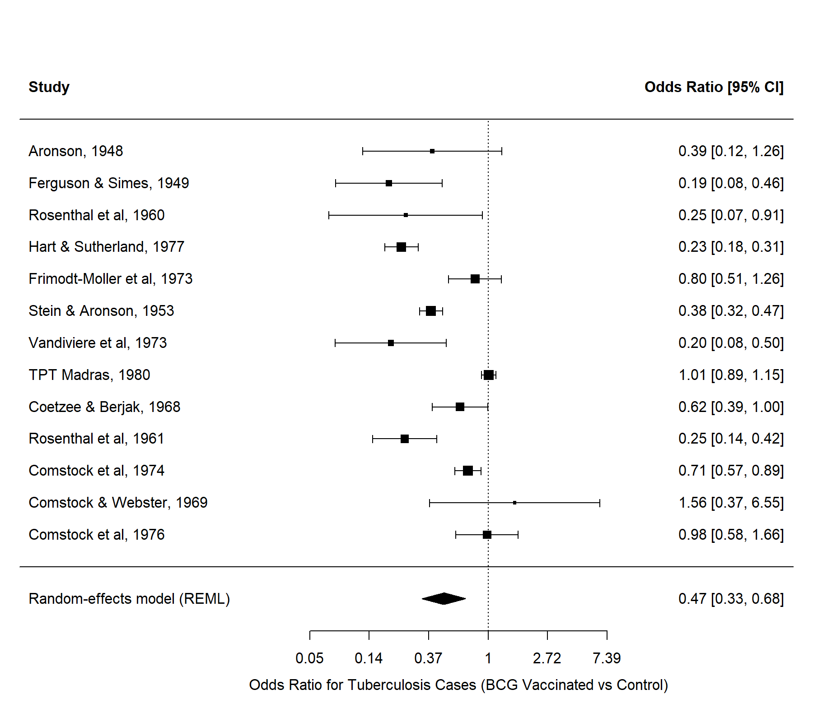
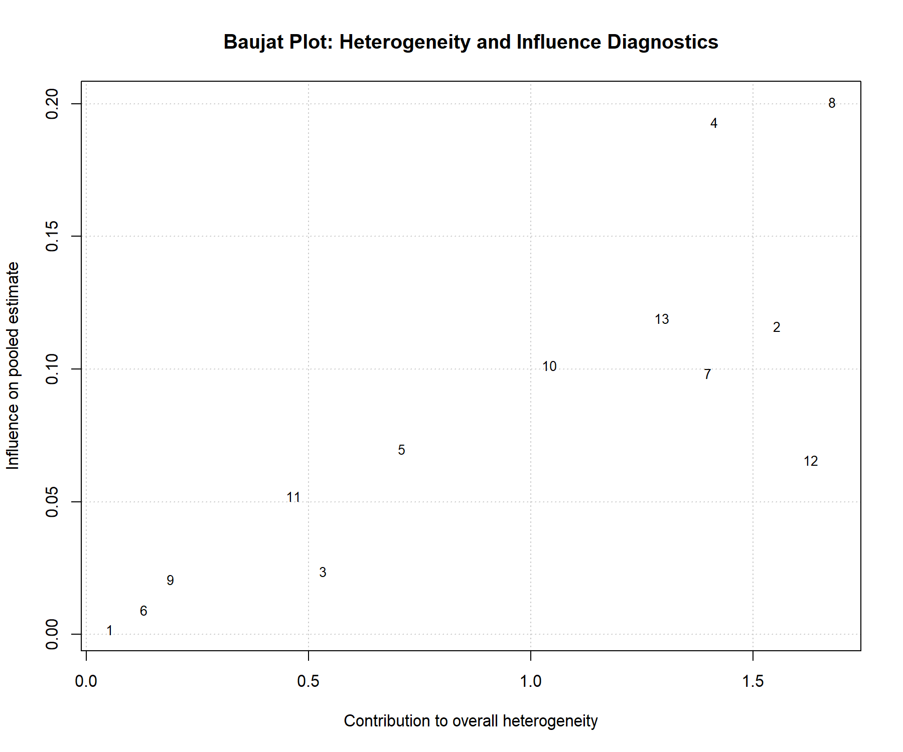
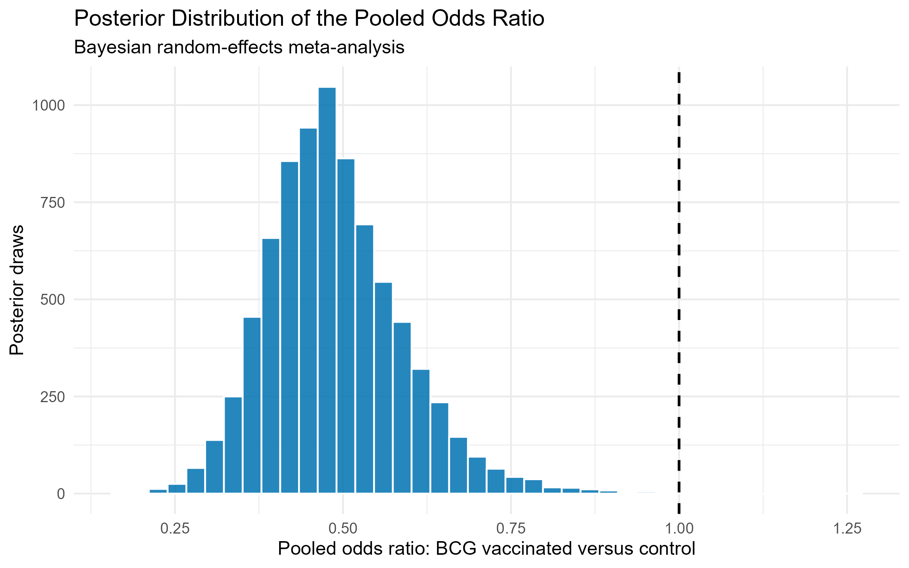
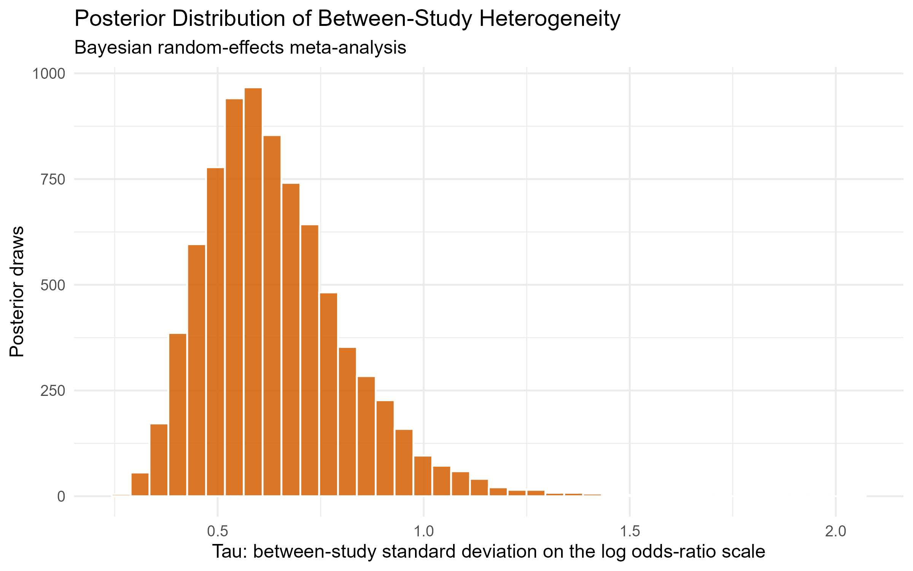

The Project 7 Quarto report now looks complete and professional.

It correctly includes:

- Forest plot
- Heterogeneity and Baujat diagnostics
- Bayesian model description and priors
- MCMC diagnostics
- Posterior pooled-odds-ratio plot
- Posterior heterogeneity (`tau`) plot
- Frequentist versus Bayesian comparison table
- Reproducibility instructions
- Limitations and conclusion

## Next: finalise the Project 7 README

Open `README.md` in the main Project 7 folder and replace it with this:

```markdown
# Bayesian Random-Effects Meta-Analysis of Published BCG Vaccine Studies in R and Stan

## Project objective

This educational project compares frequentist and Bayesian random-effects meta-analysis using published aggregate data from historic studies of BCG vaccination and tuberculosis cases.

The workflow calculates study-level odds ratios, estimates pooled associations and between-study heterogeneity, assesses study influence, fits a Bayesian hierarchical model in Stan, and compares frequentist confidence intervals with Bayesian credible intervals.

## Dataset

The project uses the `dat.colditz1994` dataset distributed through the R package `metadat`.

The dataset contains aggregate 2×2 event data from 13 historic published studies:

- Tuberculosis cases in BCG-vaccinated groups
- Participants without tuberculosis in BCG-vaccinated groups
- Tuberculosis cases in control groups
- Participants without tuberculosis in control groups

This is an educational re-analysis of historic published aggregate data. It is not a new systematic review, treatment recommendation, regulatory submission, or health technology assessment.

## Analysis workflow

1. Loaded published BCG vaccine study-level event data from `metadat`.
2. Calculated study-level log odds ratios and sampling variances.
3. Fitted a frequentist random-effects meta-analysis using REML.
4. Created a forest plot.
5. Quantified heterogeneity using Cochran’s Q, tau-squared, and I-squared.
6. Performed Baujat and leave-one-out influence diagnostics.
7. Fitted a Bayesian hierarchical random-effects meta-analysis in Stan using CmdStanR.
8. Assessed MCMC convergence using R-hat and effective sample size.
9. Created posterior-distribution plots for the pooled odds ratio and heterogeneity.
10. Compared frequentist confidence intervals with Bayesian credible intervals.
11. Produced a reproducible Quarto report.

## Key results

### Frequentist random-effects model

- Studies included: 13
- Pooled odds ratio: **0.475**
- 95% confidence interval: **0.330 to 0.683**
- Tau-squared: **0.338**
- I-squared: **92.1%**

### Bayesian random-effects model

- Posterior mean pooled odds ratio: **0.488**
- 95% credible interval: **0.315 to 0.717**
- Posterior mean heterogeneity, tau: **0.641**
- 95% credible interval for tau: **0.373 to 1.06**
- R-hat: **1.00** for key parameters
- No divergent-transition warnings were reported.

## Important interpretation

Both frequentist and Bayesian models estimated a pooled odds ratio below 1. However, between-study heterogeneity was substantial.

The estimates describe an association within this historic dataset. They do not establish causality, current clinical effectiveness, current BCG policy, or a recommendation for clinical or public-health use.

## Key visualisations

### Frequentist forest plot



### Heterogeneity and influence diagnostics



### Bayesian posterior pooled odds ratio



### Bayesian posterior heterogeneity



## Project structure

```text
07_bayesian_meta_analysis_stan/
├── data_raw/
├── data_processed/
├── models/
│   └── bayesian_random_effects_meta_analysis.stan
├── scripts/
├── outputs/
│   ├── figures/
│   └── tables/
├── reports/
├── references/
├── README.md
└── .gitignore
```

## Reproducibility

Run scripts in this order:

```text
scripts/01_install_packages.R
scripts/02_load_bcg_data.R
scripts/03_frequentist_random_effects_meta_analysis.R
scripts/04_heterogeneity_and_influence_checks.R
scripts/05_install_cmdstanr.R
scripts/06_bayesian_random_effects_meta_analysis.R
scripts/07_bayesian_visualisations_and_model_comparison.R
```

The Stan model is located at:

```text
models/bayesian_random_effects_meta_analysis.stan
```

## Limitations

- Historic aggregate data from only 13 studies.
- Not a systematic review with a registered protocol.
- No patient-level adjustment is possible.
- High heterogeneity limits interpretation of a single pooled estimate.
- Bayesian results depend on the selected model and prior distributions.
- No assessment of study quality, publication bias, contemporary evidence, or clinical applicability.
- Educational analysis only; not for clinical or public-health decision-making.

## Technical skills demonstrated

- R and RStudio
- Meta-analysis
- `metafor`
- Odds ratios and log odds ratios
- Random-effects modelling
- Heterogeneity assessment
- Cochran’s Q, tau-squared, and I-squared
- Baujat plots
- Leave-one-out sensitivity analysis
- Bayesian hierarchical modelling
- Stan and CmdStanR
- Markov chain Monte Carlo diagnostics
- Posterior distributions and credible intervals
- Quarto reporting
- Git and GitHub

## Author

Akash Bhardwaj  
MSc Precision Medicine candidate, University of Glasgow
```